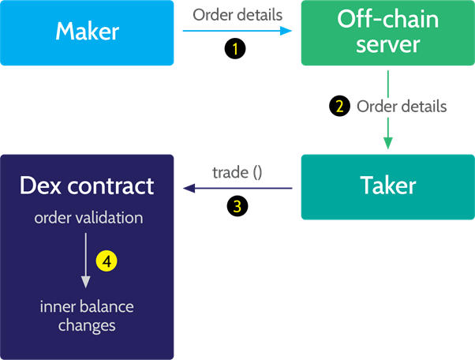
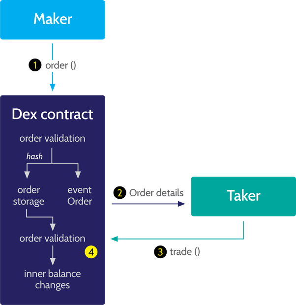
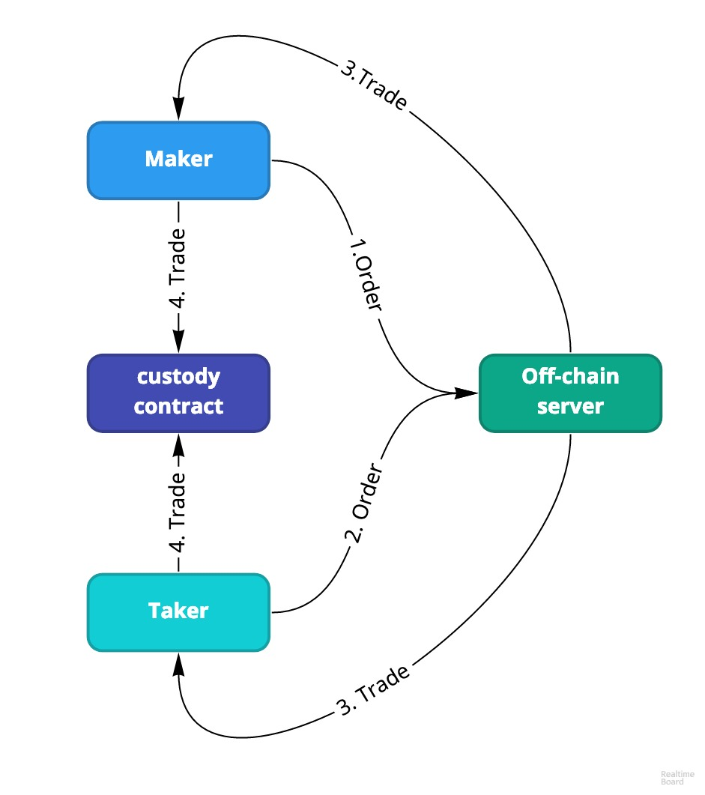

# Simple implementation of L2 exchange protocol with partial reservation of special market participants - market makers.

Includes the following components:

1. Order book
2. Api gateway
3. payment channel contract for  Zilliqa blockchain
4. payment channel contract for  Ethereum blockchain, also including a credit service with fractional-reserve for market makers based on DAI stablecoin(detailed in the docs)

## about L2

In this small brief, I tried to explain as much as possible the principles of the operation of the L2 protocol and its main difference from the existing solutions.

### DEX vs CEX
The main difference between DEX and CEX is the matching of orders (matching) and deposit storage (the custodial system), CEX has these systems running off-line, and therefore all risks are on the stock exchange, the realization of which often leads to default of such stock exchanges. As a response to this risk, DEX arose.

### DEX family

DEX exchanges can be classified according to two criteria:
1. Order Matching System(matching architecture)
2. Custodian system

**Matching**

There are two basic principles of order matching in DEX: outside the chain and inside the chain.

In the first case, orders are stored on the exchange servers, and the interaction with the blockchain occurs at the moment when the client wants to close the order. In the latter case, orders are stored in exchange smart contracts.

---
***1. Off-chain***. Most existing exchanges use this principle of operation. In general terms, this can be described as follows:

> 1. The seller (maker) makes an order, signs it and sends it to the exchange server.
> 2. The buyer (Taker) selects the order and receives its data from the server.
> 3. The buyer sends the transaction to the exchange contract calling the trading method
> 4. The contract verifies the authenticity of the order and, if everything goes well, the contract changes the balance of the participants and completes the transaction.
---
***2. On-chain***. The main difference of the chain principle is that the signature of the order is stored in the contract.

> 1. The seller calls the order method, which creates a hash of the order and stores it in the storage of the contract.
> 2. The buyer can get the details of the order directly from the blockchain using the event log contract.
> 3. As in the previous method, the buyer sends a transaction containing a call to the trade method into an exchange contract.
> 4. The contract checks whether one of the following conditions is met: the hash of the received order is contained in the order object; Order signed by the seller. The first check is required for chain-based orders, the second for non-chain orders. If the conditions are met, the contract changes the balance of participants and completes the transaction.

**Custody**

Some exchanges hold users funds on contracts, others change balances with the execution of each order.
In the first case, in order to complete a transaction on such an exchange, the user must transfer tokens from his address to the exchange's smart contract using the deposit or depositToken methods. In this case, user balances are stored in the internal objects of the contract. When the transaction is successfully completed, the contract overwrites the remnants stored in its repository, and the tokens remain on the balance of the contract.
User balances (** clearing ** transactions) actually change when calling methods of withdrawal / deposit.

In the second case, the exchanges change user balances every time an order is closed. In this case, before making a transaction, users send a transaction using the aprove method, which allows the exchange intermediary contract to send a certain number of tokens in the trading process. When an order is closed, the exchange contract causes a proxy contract that translates between user addresses.

### L2

In my understanding, the L2 is a deep DEX upgrade.

L2 matches off-chain orders, on-chain depositing, clearing is done either by the user, providing the last signed trade to the contract, or the exchange sends the last order received from the trader, if the trader has not done so for any reason. The offchain part ceases to accept orders from the user for a predetermined time until the end of the channel lifetime.

Thus, in L2, a problem was solved that was haunting all DEX - **performance and delays** in operation did not depend on the capacity of the blockchains.

**The second important advantage** L2 is the native support of several blockchains - those L2 are not limited to the operation of one chain.

#### Functional algo

> 1. The seller (maker) makes an order, signs it and sends it to the exchange server.
> 2. The buyer (taker) makes an order, signs it and sends it to the exchange server.
> 3. The exchange advances the order, the filled order is signed by the exchange and sent to the tanker and the maker.
> 4. To update the deposit, the trader (maker / taker) sends the last trade received from the exchange to the channel contract.

